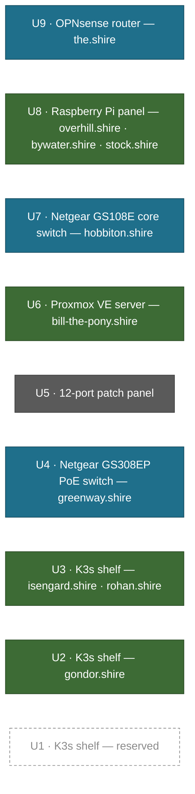

# Rack Layout

A 9U 10" mini rack — not a 19" rack. Everything in it is a mini-PC, an SBC or an
eight-port switch, which is what makes 10" viable.

## Slot detail

| U | Contents | Nodes |
|---|---|---|
| 9 | OPNsense router | [[the.shire]] |
| 8 | Raspberry Pi panel | [[overhill.shire]], [[bywater.shire]], [[stock.shire]] |
| 7 | Core switch | [[hobbiton.shire]] |
| 6 | Proxmox VE server | [[bill-the-pony.shire]] |
| 5 | 12-port patch panel | — |
| 4 | PoE switch | [[greenway.shire]] |
| 3 | K3s shelf | [[isengard.shire]], [[rohan.shire]] |
| 2 | K3s shelf | [[gondor.shire]] |
| 1 | K3s shelf | *free* |

## Outside the rack

| Node | Why |
|---|---|
| [[valinor.shire]] | Mac Mini M4 on a shelf beside the rack |
| [[bree.shire]] | PoE, wall/ceiling mounted for coverage |
| [[tuckborough.shire]] | Moves around — development board, not permanently mounted |
| [[buckland.shire]], [[crickhollow.shire]] | Orange Pi boards, not panel-mounted |
| [[gondolin.shire]] | Position not recorded |
| [[iron-hills.shire]] | Workstation, at the desk |

## Notes

- A 0.5U patch panel handles cable management between the switches and the
  devices. It shares U5 with the 12-port panel.
- One free U at the bottom, reserved for a fourth K3s node.
- The legacy drawio source is kept at `Assets/server-rack-diagram.drawio` until
  this diagram has been checked against the physical rack.

## Related

- [[Hardware Summary]]
- [[Power Budget]]
- [[Future Hardware]]
