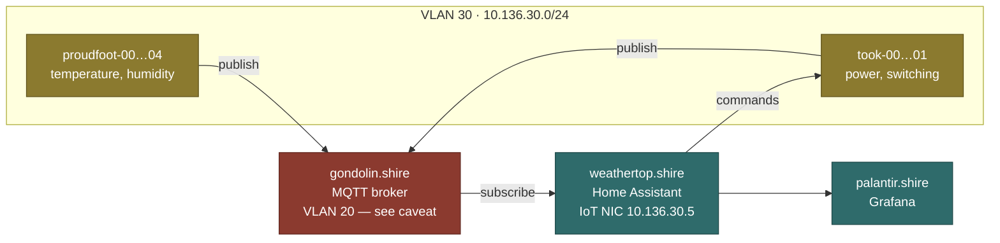

# MQTT

The message bus for everything on VLAN 30. Sensors publish, [[Home Assistant]]
subscribes.

## Data flow

> [!bug] The broker's position does not add up
> [[gondolin.shire]] is documented on VLAN 20, while its publishers are on
> VLAN 30 and [[Firewall Rules]] denies VLAN 30 → VLAN 20 outright. As drawn,
> this flow cannot work.
>
> Three candidate explanations, tracked on [[gondolin.shire]]:
> 1. the broker also has an interface on VLAN 30;
> 2. there is an allow rule missing from [[Firewall Rules]];
> 3. the broker the devices actually reach is on [[weathertop.shire]]'s IoT NIC
>    and gondolin does something else entirely.
>
> Everything below is written against explanation 1. Verify before relying on
> it.

## To document

> [!todo] Stub
> - Broker software — Mosquitto standalone, or the Home Assistant add-on
> - Bind address, port, and which interface it listens on (this settles the
>   question above)
> - Topic naming scheme. Nothing is agreed yet; something like
>   `homelab/<family>/<host>/<measurement>` would at least be predictable.
> - QoS per topic, retained messages, last-will configuration
> - Authentication and ACLs. An open broker on an isolated VLAN is defensible;
>   an undocumented one is not.
> - The Home Assistant MQTT integration configuration

## Related

- [[gondolin.shire]]
- [[Sensors]]
- [[Smart Plugs]]
- [[Home Assistant]]
- [[Firewall Rules]]
