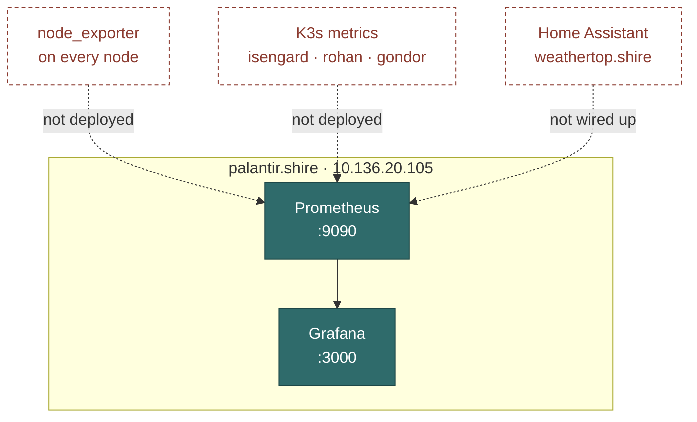

# Monitoring Stack

Prometheus scrapes, Grafana draws. Both on [[palantir.shire]].

> [!warning] The stack is running but not connected to anything
> Dashed edges are targets that do not exist yet. Node exporters are documented
> as planned on every host and deployed on none, so [[Prometheus]] currently has
> almost nothing to scrape and [[Grafana]] has almost nothing to draw.
>
> Deploying node_exporter across the fleet is the single change that turns this
> from an installed stack into a working one.

> [!bug] Which Prometheus?
> [[K3s Workloads]] also lists Prometheus in the `monitoring` namespace. Decide
> whether that is a second instance, a federation target, or a stale entry —
> the scrape configuration depends entirely on the answer.

## Order of work

1. Settle the two-instances question above.
2. Deploy node_exporter to every node in [[Node Registry]].
3. Define scrape targets — static list, or discovery.
4. Bring [[took-00.shire]] power data in, so [[Power Budget]] can stop
   estimating.
5. Then [[Dashboards]], then [[Alerting]].

Alerting last: an alert on a metric nobody has verified is a false alarm
generator.

## To document

> [!todo] Stub
> - `prometheus.yml` structure, scrape intervals
> - Retention and how the 50 GB disk is sized against it
> - Grafana data source and provisioning
> - K3s / kube-state-metrics integration

## Related

- [[Prometheus]]
- [[Grafana]]
- [[Dashboards]]
- [[Alerting]]
