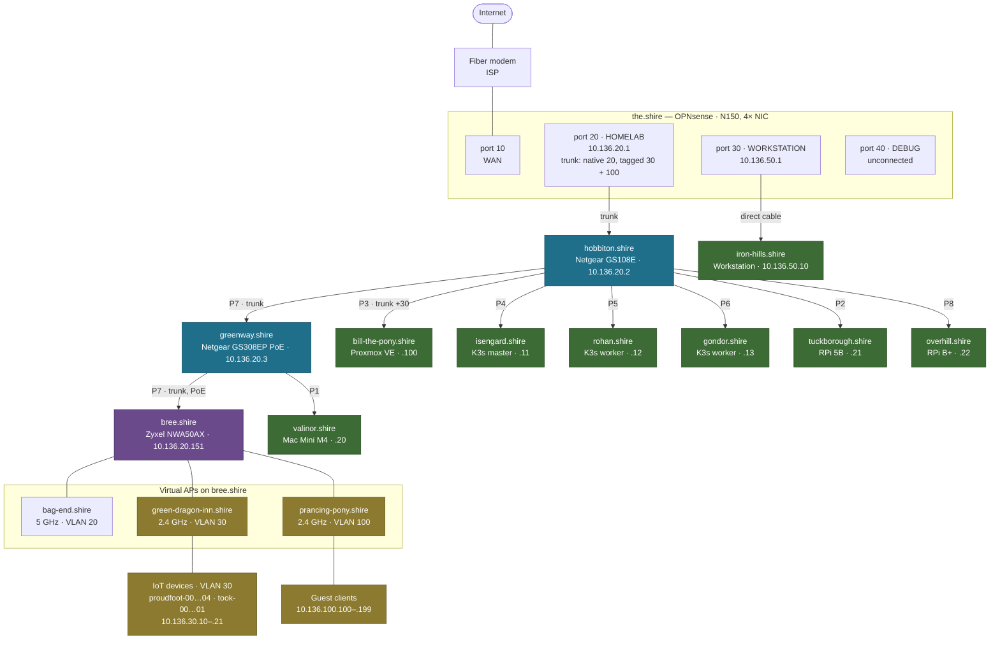
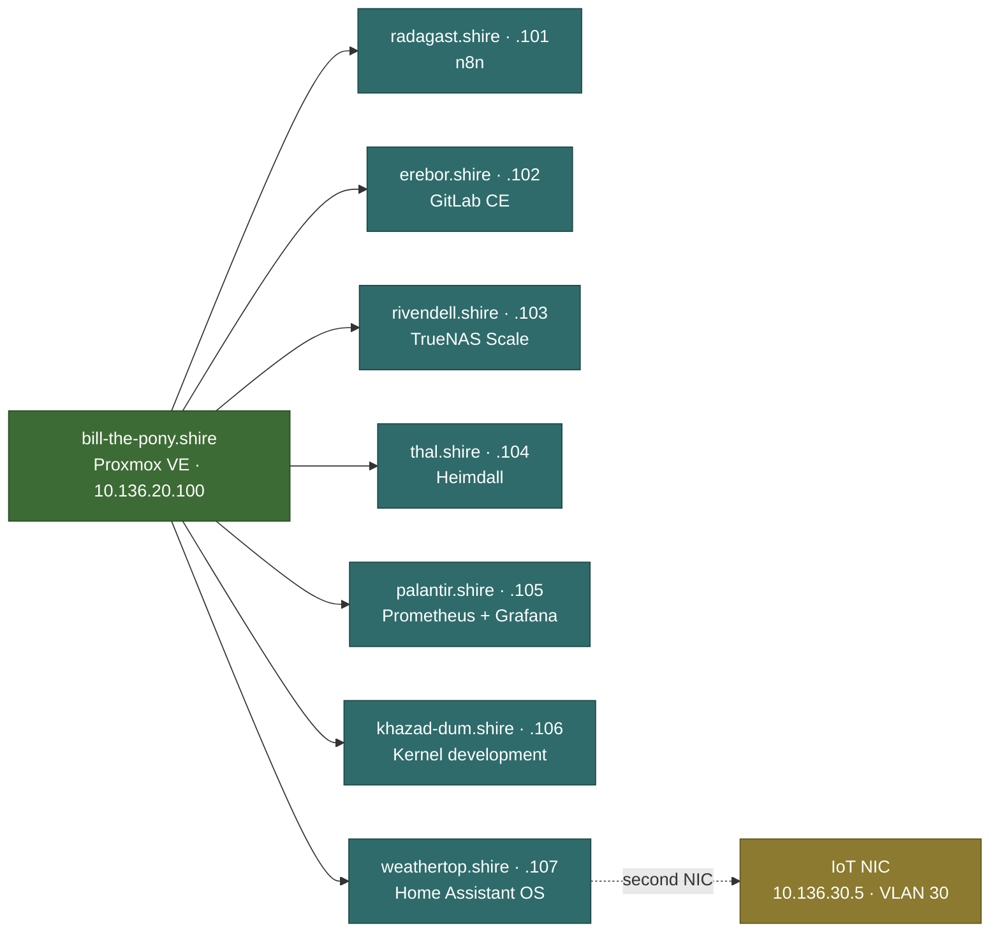

# Network Topology

The lab sits on the **10.136.0.0/16** supernet. Every segment is a subnet of it,
routed and firewalled by [[the.shire]].

## Physical topology

Not shown: [[gondolin.shire]] has no recorded switch port. See its note.

## Proxmox guests

Everything below hangs off one host and never touches a physical cable.

## Layers

| Layer | Node | Hardware |
|---|---|---|
| WAN | — | Fiber modem, ISP-supplied |
| Router / firewall | [[the.shire]] | OPNsense on N150 Mini-PC |
| Core switch | [[hobbiton.shire]] | Netgear GS108E |
| PoE switch | [[greenway.shire]] | Netgear GS308EP |
| Access point | [[bree.shire]] | Zyxel NWA50AX, OpenWRT |
| Hypervisor | [[bill-the-pony.shire]] | Proxmox VE |
| Kubernetes | [[isengard.shire]], [[rohan.shire]], [[gondor.shire]] | K3s |

## Related

- [[VLANs]] — segmentation
- [[IP Plan]] — address assignments
- [[Switch Ports]] — port-by-port
- [[Firewall Rules]] — what may talk to what
- [[Wireless]]
