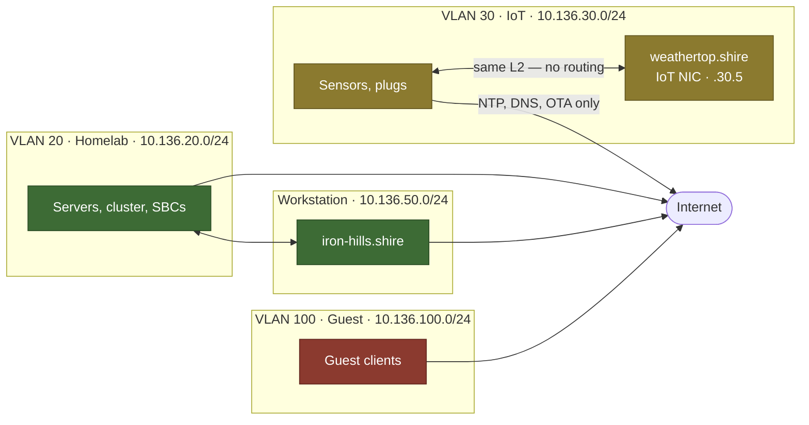

# VLANs

Three tagged VLANs plus one physically separate segment. All tagging terminates
on [[the.shire]].

## Segments

| VLAN | Name | Subnet | Gateway | DHCP | Purpose |
|---:|---|---|---|---|---|
| 20 | Homelab | 10.136.20.0/24 | 10.136.20.1 | .150 – .200 | Trusted infrastructure |
| 30 | IoT | 10.136.30.0/24 | 10.136.30.1 | .100 – .199 | Sensors and actuators |
| 100 | Guest | 10.136.100.0/24 | 10.136.100.1 | .100 – .199 | Untrusted guests, Internet only |
| — | Workstation | 10.136.50.0/24 | 10.136.50.1 | static only | [[iron-hills.shire]], own router port |

> [!warning] The workstation is not a VLAN
> It has its own physical interface on [[the.shire]] (port 30) and no tag. The
> subnet is `.50` rather than `.30` precisely so a firewall rule can never
> confuse it with the IoT VLAN.

## Trust model

Only permitted flows are drawn. Everything not drawn is denied — the full
matrix is a table in [[Firewall Rules]], because that is what a matrix is.

The single interesting edge is IoT ↔ Home Assistant. It is *not* a firewall
exception — [[weathertop.shire]] has a second NIC on VLAN 30, so the traffic
never leaves layer 2 and the deny between VLAN 30 and VLAN 20 stays absolute.

## Tagging

| Link | Native | Tagged |
|---|---:|---|
| [[the.shire]] port 20 → [[hobbiton.shire]] P1 | 20 | 30, 100 |
| [[hobbiton.shire]] P7 → [[greenway.shire]] P8 | 20 | 30, 100 |
| [[greenway.shire]] P7 → [[bree.shire]] | 20 | 30, 100 |
| [[hobbiton.shire]] P3 → [[bill-the-pony.shire]] | 20 | 30 |

VLAN 30 reaches the hypervisor so [[weathertop.shire]] can hold an IoT NIC.
VLAN 100 does not — nothing on the hypervisor has any business on the guest
network.

Every other switch port is an access port on VLAN 20. See [[Switch Ports]].

> [!todo] To document
> - The OPNsense side of the 802.1Q sub-interface configuration
> - The VLAN group configuration on both Netgear switches
> - The OpenWRT bridge-VLAN mapping on [[bree.shire]]

## Related

- [[Network Topology]]
- [[Firewall Rules]]
- [[IP Plan]]
- [[Wireless]]
- Legacy sketch: `Assets/vlan-dummy.excalidraw`
