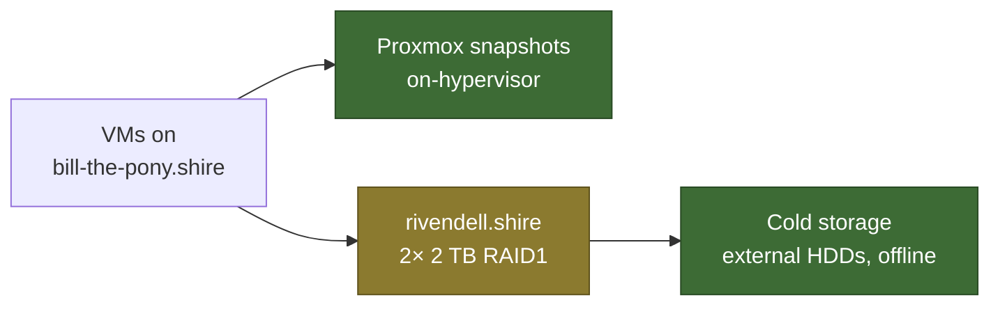

# Backup Strategy

Three layers, and only two of them are actually backups.

| Layer | Protects against | Does **not** protect against |
|---|---|---|
| Proxmox snapshots | A bad upgrade, a wrong `rm` | The hypervisor dying — they live on it |
| TrueNAS RAID1 | One disk failing | Deletion, corruption, fire, theft |
| Cold storage | Everything above | Whatever happened since the last rotation |

> [!warning] RAID is not a backup
> The mirror on [[rivendell.shire]] is redundancy. It replicates a deletion just
> as faithfully as it replicates a write. Cold storage is the only layer here
> that survives a mistake.

## To document

> [!todo] Stub
> - Proxmox backup schedule and retention per VM
> - TrueNAS dataset snapshot schedule
> - Cold storage rotation: how often, how many sets, where they live
> - RTO and RPO targets — currently undefined
> - **The critical-data inventory.** What must survive: GitLab repositories on
>   [[erebor.shire]], Home Assistant configuration and history on
>   [[weathertop.shire]], n8n workflows on [[radagast.shire]], Grafana
>   dashboards on [[palantir.shire]]. Nothing is currently written down as
>   in-scope or out-of-scope.
> - Restore testing. An untested restore is a hypothesis.

## Related

- [[TrueNAS Scale]]
- [[Proxmox Backups]]
- [[Storage]]
