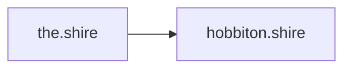

# Conventions

House rules for this vault. Read this before adding a note — consistency is what
makes the graph and the search useful.

## Vault layout

| Folder | Holds |
|---|---|
| `Nodes/` | One note per physical or virtual machine. Atomic, authoritative. |
| `Infrastructure/` | Hardware, rack, power — things you can touch. |
| `Networking/` | Topology, VLANs, firewall, switching, DNS, wireless. |
| `Compute/` | Proxmox VE and the K3s cluster. |
| `Storage/` | TrueNAS and the backup strategy. |
| `Services/` | One note per self-hosted service. |
| `IoT/` | Sensors, plugs, MQTT. |
| `Monitoring/` | Prometheus, Grafana, alerting. |
| `Automation/` | CI/CD and configuration management. |
| `Runbooks/` | Step-by-step procedures. Imperative mood, numbered. |
| `Journal/` | Dated lab diary and LinkedIn post archive. |
| `Assets/` | Attachments: images, drawio, excalidraw. |
| `_meta/` | This note, templates, inbox. |

## Notes are atomic

Every node gets its own note. Every service gets its own note. A fact lives in
exactly one place; everything else links to it.

- A node's IP, hardware and role live in its note under `Nodes/`.
- [[Node Registry]] is a generated-by-hand *index*, not a second source of truth.
  If the two disagree, the node note wins.

## Links

Wikilinks only: `[[the.shire]]`, `[[Node Registry|the registry]]`.

Link every hostname the first time it appears in a note. This is what fills the
graph and the backlink pane — a hostname written as plain text is a dead end.

## Note titles

- Node notes are titled with the **full hostname**: `the.shire`, `bill-the-pony.shire`.
  Full hostnames also make Obsidian's *Unlinked mentions* pane useful.
- Everything else uses **Title Case prose**: `Rack Layout`, `Backup Strategy`.
- Runbooks start with a verb: `Create Proxmox VM`, `Upgrade K3s`.
- Journal entries are prefixed `YYYY-MM-DD`.

## Properties (frontmatter)

Keep frontmatter to facts a machine could filter on. Prose belongs in the body.

Node notes:

```yaml
type: node
hostname: bill-the-pony.shire
ip: 10.136.20.100
vlan: 20
category: compute        # network | compute | vm | sbc | iot | workstation
hardware: N150 Mini-PC
os: Proxmox VE
role: Proxmox VE hypervisor
power-idle-w: 8
power-peak-w: 30
status: active           # active | planned | retired
tags: [node, compute]
```

Service notes:

```yaml
type: service
host: "[[bill-the-pony.shire]]"
url: http://10.136.20.101:5678
port: 5678
deployment: proxmox-vm   # proxmox-vm | k3s | docker | native
status: running          # running | planned | retired
tags: [service, automation]
```

Wikilinks in frontmatter must be quoted — Obsidian then renders them as real
links in the properties panel.

## Templates

The core Templates plugin is pointed at `_meta/Templates/`:

- [[Node]] — a machine
- [[Service]] — a self-hosted service
- [[Runbook]] — a procedure
- [[Journal Entry]] — a diary entry

Use them. The frontmatter above is tedious to retype and easy to get subtly
wrong by hand.

## Diagrams

**Mermaid, in the note itself.** Obsidian renders it natively, GitHub renders it
too, and it stays diffable in git. No screenshots of diagrams, no binary formats
for anything that could be a graph.



Legacy `.drawio` and `.excalidraw` files live in `Assets/` and are being replaced
by Mermaid as each page is rewritten.

Use a **table**, not a diagram, for matrices — firewall rules, port assignments
and IP lists are tables.

## Naming scheme

Tolkien / Middle-earth, `.shire` suffix, lowercase, hyphen-separated.

| Group | Pattern |
|---|---|
| Infrastructure | Middle-earth places (`the.shire`, `hobbiton.shire`, `bree.shire`) |
| VMs | Middle-earth places and characters (`erebor.shire`, `radagast.shire`) |
| IoT sensors | Hobbit surname `proudfoot-NN.shire` |
| IoT plugs | Hobbit surname `took-NN.shire` |
| SSIDs / virtual APs | Shire locations (`bag-end.shire`, `green-dragon-inn.shire`) |

> [!warning] Name collision
> `bag-end.shire` is reserved for the home Wi-Fi SSID. The Raspberry Pi B+ is
> therefore called [[overhill.shire]].

## Secrets

Never. No passwords, pre-shared keys, API tokens, certificates or private keys —
not even "temporarily". Document *that* a credential exists and where it is
stored, never its value.

## Status callouts

Use Obsidian callouts rather than emoji headings:

```markdown
> [!todo] Stub
> Content still to be written.

> [!info] Estimated
> Values not yet verified against the live system.
```
